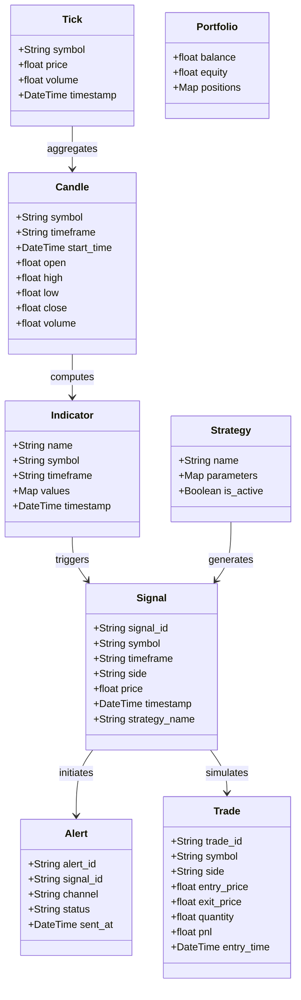

# Domain Models

This document defines the core domain objects of the AI-Powered Trading Intelligence Platform, ensuring unified naming conventions across both the backend engine and frontend services.

## Core Entities

## Domain Object Definitions

1. **Tick**: The smallest atomic unit of market data, representing an individual transaction or price update at a specific point in time.
2. **Candle (OHLCV)**: An aggregated price block (Open, High, Low, Close, Volume) over a fixed interval (e.g., 5-minute timeframe).
3. **Indicator**: Calculated mathematical values derived from historical candle data (e.g., RSI, EMA). Computed incrementally on new candle closes.
4. **Strategy**: A collection of evaluation rules and parameter sets that monitor indicator states to generate high-probability trade ideas.
5. **Signal**: An actionable trade proposal (Buy/Sell, entry target, stop loss, take profit) produced by a strategy.
6. **Alert**: A formatted notification dispatched to external communication channels (e.g., Telegram, Discord) indicating a validated signal.
7. **Trade**: A simulated (paper) trade record that tracks active positions, execution, exits, and actualized profit and loss (PnL).
8. **Portfolio**: Represents the simulated trading account balance, equity curve, margin, and active holdings.
9. **RuntimeState**: Rolling thread-safe state trackers holding recent OHLCV buffers and computed indicator values in memory.
10. **SessionState**: Temporary context tracking trading hours, daily signal counters, and global risk limits.
