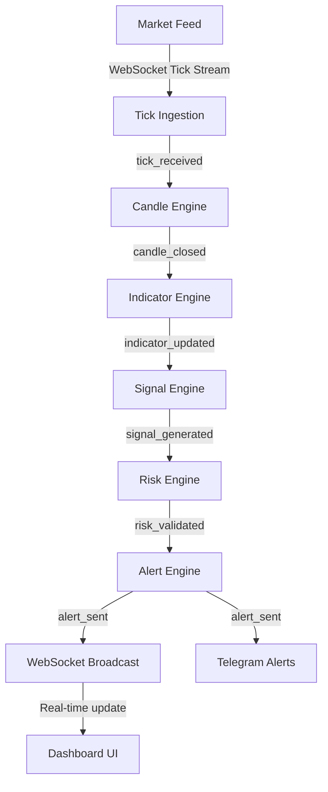

# System Overview

## Core Pipeline

## Architecture Style
- **Async Modular Monolith**: High developer velocity with logical component boundaries, allowing future extraction of performance-critical services.
- **Event-Driven Internal Communication**: Weakly coupled components communicating asynchronously via an in-memory event bus and Redis Pub/Sub.
- **Runtime In-Memory State Engine**: Extremely fast rolling buffers storing price history and calculated indicators in-memory per symbol/timeframe.
- **Plugin-Based Indicator System**: Fully decoupled indicators loaded dynamically, implementing standard mathematical contracts for incremental calculation.

## Core Infrastructure
- **Python 3.12+ / FastAPI**: Core runtime backend utilising Python's native `asyncio`.
- **Next.js & TypeScript**: Frontend UI utilizing TailwindCSS, Zustand for state management, and TradingView's Lightweight Charts for real-time visualization.
- **PostgreSQL**: Long-term relation storage for strategy telemetry, candle logs, signal lifecycles, and trades.
- **Redis**: Low-latency cache, transient runtime session tracker, and pub/sub broker for real-time dashboard propagation.
- **Docker Compose**: Seamless developer environment containerization.
